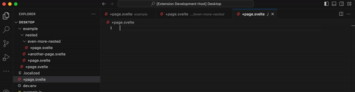

# Tab Labels Sample

This example shows an ability to rename tabs with Extensions API.

## Demo

## Running the Sample

### Prerequisites

You should have vscode built from [Alex0007/vscode/tabLabels](https://github.com/Alex0007/vscode/tree/tabLabels).

### How to run

- Open extension folder with built version of vscode
- Run `npm install` in terminal to install dependencies
- Run the `Run Extension` target in the Debug View. This will:
	- Start a task `npm: watch` to compile the code
	- Run the extension in a new VS Code window
